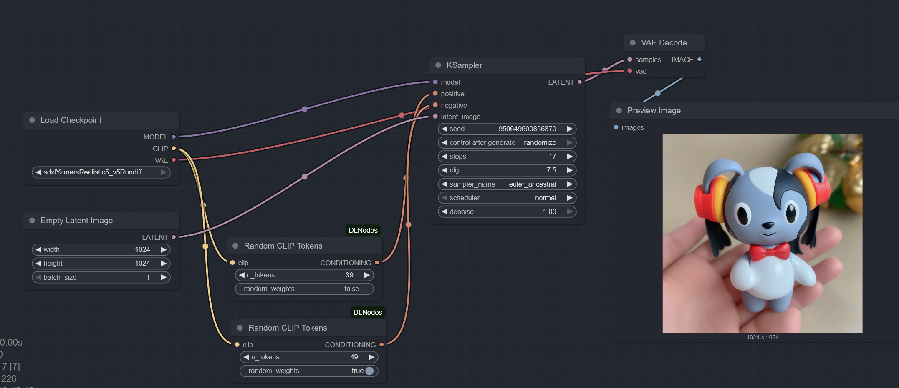
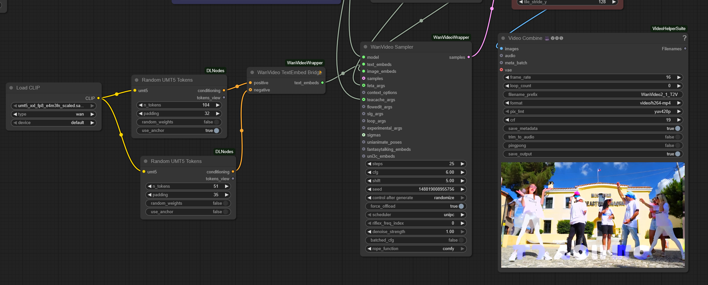

# ComfyUI-DLNodes

Couple of custom **ComfyUI** nodes that are useful for exploring unprompted / aleatoric image and video generation.

---

## CLIPRandom

Generates a sequence of **random CLIP tokens** that can be used in place of the usual *Text Encode* nodes in Stable Diffusion pipelines (both SD 1.x and SDXL).

### Widgets

| Name | Type | Range / Notes |
|------|------|---------------|
| `clip` | CLIP | The CLIP model that should receive the tokens. |
| `n_tokens` | int | 0 – 75 Number of random tokens to generate. |
| `random_weights` | bool | If **on**, assigns each token a random weight sampled from **U(-1, 1)**; otherwise all weights are **1.0**. |

---

## UMT5Random

Generates **random UMT5 tokens**. Mainly intended for [Kijai's WanVideoWrapper](https://github.com/kijai/ComfyUI-WanVideoWrapper) "ComfyUI text encoding alternative" workflow, but in theory it can be used anywhere a T5-style text encoder is used.

### Widgets

| Name | Type | Range / Notes |
|------|------|---------------|
| `umt5` | CLIP | The UMT5 / T5 text encoder. |
| `n_tokens` | int | 0 – 511 Number of random tokens. |
| `padding` | int | 0 – 511 Number of *zero-vector* padding tokens appended after the random sequence (helps "stabilise" the image). |
| `random_weights` | bool | If **on**, token weights are random in **U(-1, 1)**; otherwise **1.0**. |
| `use_anchor` | bool | Whether to append the `<eos>` token as a terminator/anchor. |

---

## String2List

Utility node that splits a string into a list using an arbitrary separator.

### Widgets

| Name | Type | Default |
|------|------|---------|
| `text` | string | *force input* |
| `separator` | string | `/` |

Returns: **list[string]**

---

### Licence

MIT